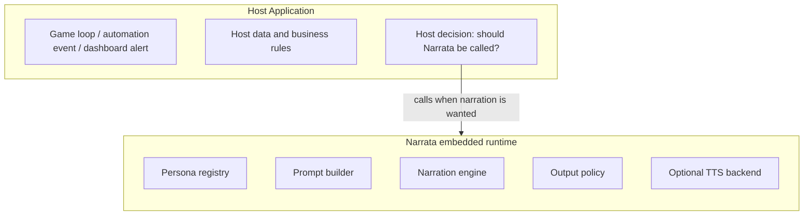
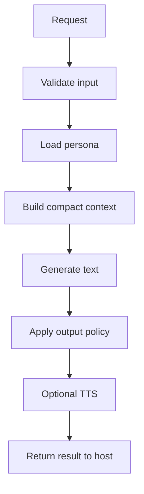
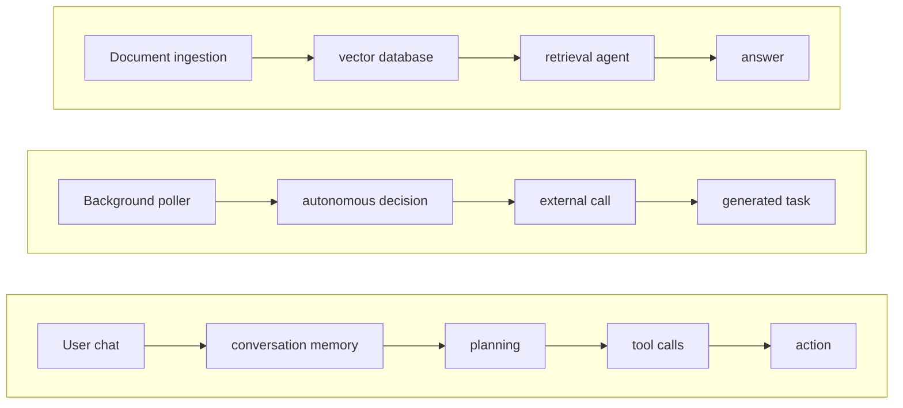

# Narrata Architecture Design

## 1. Architectural Principle

Narrata is a library-first embedded narration runtime. The host application owns execution, lifecycle, data, permissions, timing, and output routing. Narrata only transforms host-provided context into text and optionally speech.

Narrata must not become an assistant framework. The architecture should actively prevent scope creep into memory, RAG, tool calling, workflows, planning, or chat sessions.

## 2. System Boundary



Narrata does not poll the host system. The host calls Narrata when it wants narration.

## 3. Runtime Flow



## 4. Explicitly Excluded Flows

These flows must not exist in the core runtime:



If a host system wants any of that, it should implement it outside Narrata and call Narrata only for final narration.

## 5. Package Layout

```text
narrata/                  # public library package (module root)
  engine.go  config.go  request.go  result.go  persona.go  errors.go
  go.mod  README.md  personas.default.json
  cmd/narrata/            # developer CLI
  examples/              # game / home_automation / monitoring
  backend/
    text/                # backend.go, native.go, template.go, mock.go
    tts/                 # backend.go, mock.go
  internal/              # not part of the public API
    nlg/                 # in-house pure-Go narration engine (the native backend)
    prompt/  policy/  validate/  cli/
```

Recommended public import:

```go
import "github.com/danielriddell21/narrata"
```

## 6. Core Components

### 6.1 Engine

The main embedded runtime object.

Responsibilities:

- Load config.
- Load personas.
- Manage backend lifecycle.
- Accept generation requests.
- Return text/audio results.
- Expose close/shutdown methods.

Non-responsibilities:

- Conversation memory.
- Tool execution.
- Scheduling.
- Polling host systems.
- External data lookup.

### 6.2 Persona Registry

Stores personas loaded from default and user-provided persona files.

Responsibilities:

- Validate persona IDs.
- Resolve default persona.
- Merge built-in and user personas.
- Support optional hot reload later.

### 6.3 Context Builder

Converts request + persona + data into a compact, structured input for the
narration engine (and a prompt string for the `template`/`mock` backends).

Design goals:

- Keep prompts small.
- Prefer structured data summaries.
- Avoid leaking irrelevant data.
- Make output constraints explicit.
- Keep persona instructions separate from host data.
- Repeatedly reinforce that output should be narration, not chat.

### 6.4 Text Backend

Interface for text generation. The default is the in-house **`native`** backend:
a pure-Go, persona-conditioned generator (event-shape sentences, tone, salience)
built on `internal/nlg`. No model, no cgo, no external files — generation happens
entirely at runtime.

Other backends:

- `template` — a simpler pure-Go sentence composer.
- `mock` — deterministic output for tests.

The interface stays pluggable so a host can wrap a real model of its own (via
`nlg.WithFallback`) if it ever needs open-ended generation — but that is never a
core dependency.

### 6.5 Output Policy

Post-processing stage that enforces host and persona constraints.

Examples:

- Maximum words.
- Maximum sentences.
- No markdown.
- No raw JSON unless requested.
- No profanity.
- No unsafe persona escalation.
- Strip surrounding quotes.
- Enforce silence if host/event policy says not to speak.

### 6.6 TTS Backend

Optional speech synthesis interface. The default `mock` backend emits a valid WAV
in pure Go. TTS is optional and pluggable; the text engine works without it.

## 7. Backend Strategy

### 7.1 Text

Narration is generated **in house, in pure Go, at runtime** by the `native`
backend (`internal/nlg`):

- Structured event + data + persona → salience selection → typed realization →
  event-shape grammar → tone-conditioned clause → constraint-bounded line.
- Deterministic (seeded), instant, and self-contained.

Rationale: a model would add weight, a build toolchain, external files, and
startup latency for output that is short and structured. An authored,
persona-conditioned grammar covers narration's structured domain with zero of
that cost. Open-ended generation, if ever needed, is a host-supplied fallback,
not a core dependency.

### 7.2 TTS

- Pure-Go `mock` WAV backend today.
- A pure-Go synthesiser (e.g. formant) or host-embedded audio can follow, same
  principle: no models or cgo in the core path.

## 8. Concurrency Model

Narrata should support concurrent requests, but backends may have their own limitations.

Recommended MVP:

- Engine is safe to call from multiple goroutines.
- Requests are queued or guarded if backend is single-session.
- Configurable max concurrency.
- Context cancellation is respected.

```go
type Config struct {
    MaxConcurrent int
}
```

## 9. Error Handling

Errors should be typed and actionable.

Examples:

- `ErrPersonaNotFound`
- `ErrInvalidRequest`
- `ErrModelNotLoaded`
- `ErrGenerationTimeout`
- `ErrTTSUnavailable`
- `ErrScopeViolation`

## 10. Privacy Model

Narrata is local-first. The host system is responsible for deciding what data to pass into Narrata.

No telemetry should be emitted by default.

## 11. Scope Guardrails for Implementation

Claude Code or any implementation agent should reject attempts to add the following to core:

- `ChatSession`
- `MemoryStore`
- `ToolRegistry`
- `Agent`
- `Planner`
- `Retriever`
- `VectorStore`
- `Browser`
- `Scheduler`

Allowed concepts:

- `Engine`
- `Request`
- `Result`
- `Persona`
- `Renderer`
- `TextBackend`
- `TTSBackend`
- `OutputPolicy`
- `EventPolicy`
