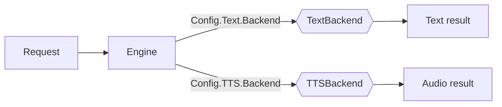

# Backends

Text and TTS backends sit behind interfaces (`TextBackend`, `TTSBackend`) and
are selected by name via `Config.Text.Backend` and `Config.TTS.Backend`. The
text engine works with no TTS backend present. Everything is pure Go — no cgo,
no model files.

## Available backends

| Kind | Name       | Notes |
|------|------------|-------|
| Text | `native` (alias `grammar`) | Persona-aware pure-Go generation (event-shape sentences, tone-conditioned) built on the [`nlg`](../nlg) library. Default for the CLI. |
| Text | `template` | Simple pure-Go sentence composer. |
| Text | `mock`     | Deterministic; the default when no backend is set. Ideal for tests. |
| TTS  | `mock`     | Emits a valid 16-bit PCM WAV derived from the text. Optional. |

All backends compile and run everywhere with `go build ./...`.

## Bringing your own model

Narrata ships no model and no cgo. For tasks that need a real language model,
implement `nlg.Backend` (`Generate(ctx, prompt) (string, error)`) around any
engine and register it with `nlg.WithFallback`, or wrap it as a text backend.
