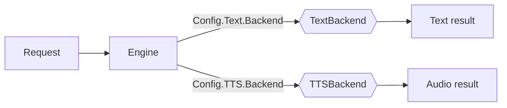

# Backends

Text and TTS backends sit behind interfaces (`TextBackend`, `TTSBackend`) and
are selected by name via `Config.Text.Backend` and `Config.TTS.Backend`. The
text engine works with no TTS backend present.



## Available backends

| Kind | Name       | Build tag | Notes |
|------|------------|-----------|-------|
| Text | `mock`     | —         | Deterministic; the default when no backend is set. Ideal for tests. |
| Text | `template` | —         | Pure-Go sentence composer; real local text with no model file. |
| Text | `native` (alias `grammar`) | — | Pure-Go, persona-aware generator (event-shape sentences, tone-conditioned) built on the [`nlg`](../nlg) library. Zero deps, no model. |
| Text | `llama.cpp`| `llama`   | Experimental cgo binding to llama.cpp/GGUF. |
| TTS  | `mock`     | —         | Emits a valid 16-bit PCM WAV derived from the text. |
| TTS  | `kokoro`   | `kokoro`  | Experimental cgo binding to ONNX Runtime for Kokoro. |

The `mock` and `template` backends compile and run everywhere with
`go build ./...` — no cgo and no model files.

## Experimental cgo backends

The `llama.cpp` and `kokoro` backends are feasibility implementations, excluded
from the default build and CI so the pure-Go path stays green. They require
local native libraries and target recent upstream C APIs that evolve between
releases. Build instructions, required libraries, and the tunable tensor
constants live next to the code in
[`backend/README.md`](../backend/README.md).

```bash
go build -tags llama ./...
go build -tags kokoro ./...
```
