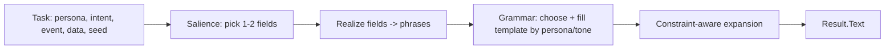

# Design: `nlg` — a pure-Go, persona-aware, zero-weight generation library

**Branch:** `exp/pure-go-backends` · **Status:** proposed design

## Summary

`nlg` is a small Go library with an **LLM-shaped call site** that you can drop in
wherever you'd otherwise call an LLM for a **structured** task — and specify a
**persona** to shape the voice. It is **pure Go, standard-library only, no trained
weights, no model files, no cgo**. Output is deterministic and instant.

It is **procedural generation, not a neural model**: the capability comes from an
authored, persona-conditioned grammar plus runtime statistics and constraint
solving — not from learned parameters. It covers the *structured* subset of
"things people use an LLM for" and, for the open-ended rest, exposes the **same
interface** with a pluggable real backend so it degrades gracefully instead of
pretending. See [What it can / can't do](#what-it-can--cant-do).

## Call site

```go
// Personas are first-class: define in Go, or load the same JSON Narrata uses.
dm := nlg.Persona{
    ID:    "dungeon_master",
    Style: nlg.Style{Tone: "dramatic", Energy: "high", Humour: "light", Verbosity: "short"},
    Rules: []string{"vivid but concise", "never break character"},
    Constraints: nlg.Constraints{MaxWords: 24, MaxSentences: 2},
}

c, _ := nlg.New(nlg.WithPersona(dm))

out, _ := c.Generate(ctx, nlg.Task{
    Persona: "dungeon_master",
    Intent:  nlg.Narrate,
    Event:   "player_low_health",
    Data:    map[string]any{"player": "Ari", "health": 8, "enemy": "Bone Dragon"},
    Constraints: nlg.Constraints{MaxWords: 20}, // overrides persona default
})
// out.Text: "Ari staggers as the Bone Dragon closes in — no time for optimism."
```

## Public API (sketch)

```go
package nlg

type Style struct{ Tone, Energy, Humour, Verbosity string }

type Constraints struct {
    MaxWords      int
    MaxSentences  int
    AllowMarkdown bool
}

// Persona is a specifiable style profile (definable in Go or loaded from JSON,
// same schema as Narrata personas).
type Persona struct {
    ID          string
    Style       Style
    Rules       []string
    Constraints Constraints // defaults; per-Task Constraints override
}

type Intent string

const (
    Narrate   Intent = "narrate"   // v1: structured data -> a line, in character
    Describe  Intent = "describe"  // v1: describe an entity/state
    Summarize Intent = "summarize" // roadmap
    Classify  Intent = "classify"  // roadmap: map input to Labels
    Extract   Intent = "extract"   // roadmap: pull fields against a schema
)

// Task is the LLM-shaped request: structured in, text out.
type Task struct {
    Persona     string      // persona id (empty => default)
    Intent      Intent      // default Narrate
    Event       string      // label/intent for narrate/describe
    Data        any         // structured payload (map, struct, JSON value)
    Labels      []string    // for Classify
    Hint        string      // optional one-off steer
    Constraints Constraints // overrides persona defaults
    Seed        uint64      // determinism; 0 => derive from Task
}

type Result struct {
    Text  string
    Label string // set for Classify
}

type Client struct{ /* personas, grammar, fallback */ }

func New(opts ...Option) (*Client, error)
func (c *Client) Generate(ctx context.Context, t Task) (Result, error)

// Options
func WithPersona(p Persona) Option
func WithPersonasJSON(data []byte) Option
func WithFallback(b Backend) Option // for open-ended intents / unknown input

// Backend is the escape hatch: a real LLM for the tasks procedural logic can't do.
// Any Generate(ctx, prompt) (string, error) satisfies this.
type Backend interface {
    Generate(ctx context.Context, prompt string) (string, error)
}
```

Narrata's `native` text backend becomes a thin adapter over `nlg` (parse the
prompt → `Task` → `Generate`), so the engine keeps working unchanged.

## Generation pipeline (for `narrate` / `describe`)



1. **Salience** — classify fields by kind (quantity, state, name, place, time,
   flag) and keep the top 1–2 by a narration-worthiness score, scaled by
   verbosity and the word budget. Avoids dumping every key/value.
2. **Realize** — per-kind realizers turn fields into fragments: `health:8` →
   "health at 8"; `room:"utility"` → "in the utility room".
3. **Grammar** — a small weighted grammar expands
   `S → {opener}? {event_clause} {data_clause}? {closer}?`, each non-terminal
   choosing a production conditioned on the persona's tone/energy/humour, with
   **event-shape templates** (completion / threshold / arrival / state-change /
   generic) matched from the event name.
4. **Constraint-aware expansion** — budget-driven: optional constituents are
   included only if they fit `MaxWords`/`MaxSentences`; output is correct by
   construction, not trimmed after. `Humour=="none"` disables witty intensifiers.
5. **Determinism** — a seeded PRNG (from `Seed` or a hash of the Task) drives all
   weighted choices: stable per input, reproducible in tests, varied across
   inputs.

Other intents reuse the pieces: `summarize` = salience over many fields;
`classify` = rules/keyword scoring → `Labels`; `extract` = schema-guided field
realization returning structured data.

## What it can / can't do

**Can (pure Go, persona-conditioned):** narrate/describe structured data,
summarize known fields, classify into a fixed label set, extract against a
schema. Deterministic, instant, zero deps.

**Can't (needs weights):** open-ended Q&A, reasoning, understanding arbitrary
free-form natural language, novel fluent prose. For these, set `WithFallback`
to a real backend; `Generate` routes there (or returns a typed
`ErrNeedsModel`) instead of faking it.

Quality is bounded by the authored grammar/phrase pools — breadth comes from
authored variety, not scale.

## Techniques, mapped honestly

| LLM idea | Weight-free analogue |
|---|---|
| Constrained / structured decoding | Grammar productions guarantee shape & spec compliance |
| Sampling (temp/top-p) | Seeded weighted choice among productions |
| System prompt / control tokens | `Persona` selects grammars, pools, connectives |
| Summarization focus | Salience scoring picks narration-worthy fields |
| n-gram smoothing (optional) | Low-order Markov over an authored per-tone connective set |

## Package layout

```
narrata/
  nlg/                  # the library — stdlib only, extractable to its own module
    nlg.go              # Client, Persona, Task, Result, Options
    grammar.go          # weighted grammar + expansion
    phrases.go          # tone-conditioned pools (Go literals; no embedded assets)
    realize.go          # field -> phrase realizers
    salience.go         # field kind inference + scoring
    persona.go          # Persona + JSON loading (shared shape with narrata)
    nlg_test.go
  backend/text/native.go  # adapter: prompt -> nlg.Task -> nlg.Generate
```

Grammar/phrases are **authored Go literals** (KB-scale content, not a trained
model, not embedded files) — keeps it literally zero-asset. A `Generator`/option
lets hosts supply their own grammar to extend it.

## Decisions (defaults; easy to change)

- **v1 intents:** `narrate` + `describe`. `summarize`/`classify`/`extract` are in
  the API from day one but implemented later.
- **Identity:** lives at `narrata/nlg`, designed with no Narrata imports so it can
  become its own module with zero API change.
- **Fallback:** open-ended intents require `WithFallback`; without it they return
  `ErrNeedsModel` rather than degraded nonsense.

## Phased plan

**Status: Phases 1–6 implemented** on `exp/pure-go-backends` (package `nlg`, with
`narrate`/`describe`/`summarize`/`classify`/`extract`, event-shape templates,
salience + realizers, constraint-aware expansion, `WithFallback`/`ErrNeedsModel`,
`WithOpeners` extensibility, tests, benchmarks, and a godoc example). The
`native` text backend routes through it.


1. **`nlg` core** — package, `Client`/`Persona`/`Task`/`Constraints`, seeded
   grammar expansion (port + generalise `native`), `narrate`. `native` backend
   adapts to `nlg`.
2. **Salience + realizers** — field kind inference and per-kind realization;
   verbosity/budget-aware selection. Adds `describe`.
3. **Event-shape templates** — completion/threshold/arrival/state-change/generic
   clause families; richer per-tone pools.
4. **Constraint-aware expansion** — budget-driven optional constituents; humour
   gating; sentence budgeting.
5. **Fallback + more intents** — `WithFallback`, `ErrNeedsModel`; `summarize`,
   then `classify`/`extract`.
6. **Polish** — docs, examples, custom-grammar option, benchmarks (target
   sub-microsecond, low/zero alloc).

## Testing

- **Golden** per `(persona, intent, event, data)`.
- **Property**: output ≤ constraints; never emits `{`/`}` or raw `key: value`;
  non-empty for valid input; deterministic per seed; varies across events/tones.
- **Fuzz** realizers with arbitrary data (no panics, bounded output).
- **Benchmarks** on the hot path.

## Non-goals

No weights, no embedded trained model, no external files, no dependencies beyond
the standard library. No chat/memory/agent behaviour (Narrata guardrails hold).
