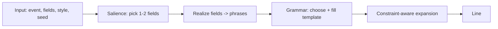

# Design: `nlg` — a pure-Go, zero-weight narration generator

**Branch:** `exp/pure-go-backends` · **Status:** proposed design

## Summary

A small, standalone Go library that turns `(event, structured data, persona)`
into a short, characterful, persona-appropriate line — **pure Go, zero
dependencies, no trained weights, no model files, no cgo**. It is deterministic
and instant, and it plugs into Narrata as the `native` text backend while also
being usable on its own like any library.

This is **procedural generation, not a neural LM**: there are no learned
parameters. "Intelligence" comes from an authored, tone-conditioned grammar plus
runtime statistics and constraint solving — not from weights. See
[Honest limits](#honest-limits).

Where modern LLM ideas *legitimately* apply without weights, we use them:
grammar-**constrained decoding**, hard **constraint satisfaction**, salience-
based content selection, and control-parameter conditioning (the persona acts
like control tokens / a system prompt).

## Why a separate package

The user asked for something that "works like a library." So the generator lives
in its own package with no knowledge of Narrata's prompt strings:

```
narrata/
  nlg/                      # the library — stdlib only
    nlg.go                  # public API: Input, Style, Constraints, Generate
    grammar.go              # grammar model + weighted expansion
    phrases.go              # tone-conditioned phrase pools (Go literals)
    realize.go              # data field -> phrase realizers
    salience.go             # pick the narration-worthy fields
    nlg_test.go
  backend/text/native.go    # thin adapter: prompt -> nlg.Input -> nlg.Generate
```

Grammar/phrases are **authored Go data (or `//go:embed` of a small rules file)**,
KB-scale — content, not a trained model. If you want *zero* embedded assets, keep
them as Go literals in `phrases.go`; that's the default here.

## Public API (sketch)

```go
package nlg

// Style conditions tone and delivery (mirrors persona.Style).
type Style struct{ Tone, Energy, Humour, Verbosity string }

// Field is one typed datum to potentially narrate.
type Field struct {
	Key   string
	Value any
	Kind  Kind // Quantity, State, Name, Place, Time, Flag, Other (inferred if unset)
}

// Constraints bound the output.
type Constraints struct {
	MaxWords     int
	MaxSentences int
	AllowMarkdown bool
}

// Input is everything the generator needs.
type Input struct {
	Event  string
	Fields []Field
	Style  Style
	Seed   uint64 // determinism; 0 => derive from Input
}

// Generate returns a single narration line honouring c.
func Generate(in Input, c Constraints) string

// Generator is a reusable, configured instance (custom grammar/phrases).
type Generator struct{ /* grammar, pools */ }
func New(opts ...Option) *Generator
func (g *Generator) Generate(in Input, c Constraints) string
```

Narrata's `native` backend becomes a ~30-line adapter that parses the prompt
(event/data/tone) and calls `nlg.Generate`. A later, cleaner integration can
have the engine pass structured data straight to `nlg`, skipping the string.

## Generation pipeline



1. **Salience** — classify fields by `Kind` and score them (quantities,
   threshold-y numbers, named entities, state changes rank high). Keep the top
   1–2, scaled by `Style.Verbosity` and the word budget. Avoids dumping every
   key/value (the current `template`/`native` weakness).
2. **Realize** — turn chosen fields into natural fragments via per-`Kind`
   realizers: `Quantity{health:8}` → "health at 8"; `Place{room:"utility"}` →
   "in the utility room"; `Flag{done:true}` → "complete".
3. **Grammar** — a small weighted grammar expands
   `S → {opener}? {event_clause} {data_clause}? {closer}?`, with each
   non-terminal choosing a production conditioned on tone/energy/humour. Event
   clauses come from **event-shape templates** (completion, threshold breach,
   arrival/departure, state change, generic) matched from the event name, so
   different event *kinds* read differently.
4. **Constraint-aware expansion** — expansion is **budget-driven**: optional
   constituents (opener, second field, closer) are included only if they fit
   `MaxWords`/`MaxSentences`; when tight, prefer shorter productions. Output is
   correct by construction, not trimmed after. Humour gate: `Humour=="none"`
   disables witty intensifiers.
5. **Determinism** — a seeded PRNG (FNV(seed | style,event,fields)) drives every
   weighted choice, so output is stable per input and reproducible in tests;
   callers can vary `Seed` for alternate phrasings.

## Techniques, mapped honestly

| LLM idea | Weight-free analogue here |
|---|---|
| Constrained / structured decoding | Grammar productions guarantee shape & spec compliance |
| Sampling (temp/top-p) | Seeded weighted choice among productions |
| System prompt / control tokens | `Style` selects grammars, pools, connectives |
| Summarization focus | Salience scoring picks narration-worthy fields |
| n-gram / smoothing (optional, Phase 3) | Low-order Markov over an embedded per-tone connective corpus for smoother joins |

None of these learn; they're deterministic algorithms over authored data.

## Testing

- **Golden tests** per `(style, event, fields)` for stable phrasing.
- **Property tests**: output ≤ `MaxWords`/`MaxSentences`; never emits `{`/`}` or
  raw `key: value` JSON; non-empty for valid input; deterministic for fixed seed;
  differs across distinct events/tones.
- **Fuzz** the realizers with arbitrary data shapes (no panics, bounded output).
- Benchmarks (should be sub-microsecond; no allocations in the hot path ideally).

## Phased plan

1. **Extract & seed** — create `nlg` package; move `native`'s logic in; add
   `Style`, `Field`, `Constraints`, seeded expansion. `native` calls `nlg`.
2. **Salience + realizers** — field `Kind` inference and per-kind realization;
   verbosity/budget-aware selection.
3. **Event-shape templates** — completion / threshold / arrival / state-change /
   generic clause families; richer per-tone opener/closer pools.
4. **Constraint-aware expansion** — budget-driven optional constituents; humour
   gating; sentence budgeting.
5. **(Optional) Markov connectives** — embedded per-tone corpus for smoother
   variation; still zero weights, still deterministic.
6. **Polish** — docs, examples, `Generator` options for custom grammars so hosts
   can extend it as a library.

## Honest limits

- No novel reasoning, no open-domain fluency, no factual synthesis. It restates
  and dramatizes host-provided data *in character*. That is exactly Narrata's
  scope (narration, not chat) — but it will not surprise you with insight the way
  a real LM can.
- Output quality is bounded by the authored grammar/phrase pools; breadth comes
  from more authored variety, not from scale.
- Best for short lines (the target). It is not a general text generator.

## Non-goals

- No weights, no `//go:embed`-ed trained model, no external files, no deps
  beyond the standard library.
- No chat/memory/agent behaviour (unchanged Narrata guardrails).
